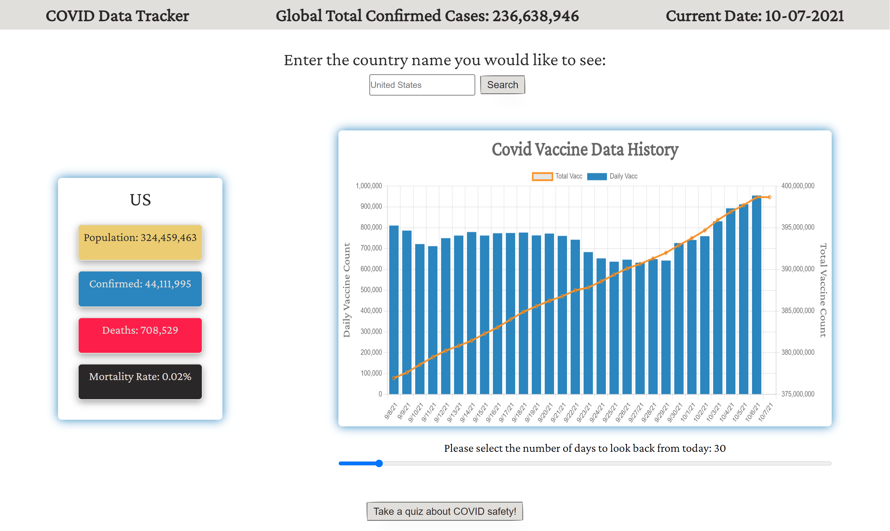

# Bootcamp-Project-1
COVID Data Tracker is an application that allows users to input a country name and be displayed with live COVID data. The user will find a graph that presents the data of vaccination of the input country with the option of choosing the time frame. A subpage of a COVID related quiz is provided for interaction. 

link to the deployed application: https://kbove.github.io/Bootcamp-Project-1/

